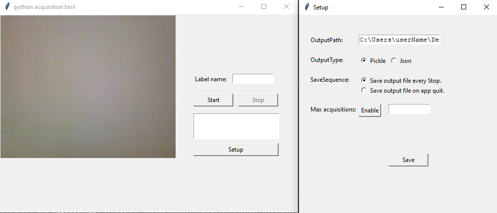

# acqTool
acqTool is a simple tool for self-labeling with an interface help.

## :books: Usage



The Tool have the main window (left) and setting window (right).

#### :arrow_right: Main Window

In this window it is possible to choose the label to be assigned to the key points during the acquisition.
The start button enables the point saving process.
The process ends with the stop button.
Below a text panel for the output messages.

#### :arrow_right: Setting Window

In the setting window you can:
- change the output path of the files,
- change the output type (pkl or json),
- change the saving sequence. At each stop or when the app closes,
- enable the maximum number of acquisitions for each "start".
To save the changes, press the Save button.

#### :arrow_right: Output format

#### :small_blue_diamond: pkl
  
  - Keypoints vector output:  
  
  - Class vector output: 
  
#### :small_blue_diamond: json
  
  - Non implemented yet.

## :rocket: Launch
```
python acqTool.py -m modelName -t modelType
```
__Note__: The current version support only [_Mediapipe_](https://github.com/google/mediapipe) model ed [_Hand_](https://google.github.io/mediapipe/solutions/hands) type. This limitation is due to my use case. 

To Launch correctly do:
```
python acqTool.py -m Mediapipe -t Hand
```

## :hammer: Technologies
- Python 3.8.11
- tkinter 8.6
- opencv 4.5.5
- threading
- os
- pickle

## :mag: Project status 
#### v0.1.1
In this version was added the entire interface and a Mediapipe model for hand detection.
#### v0.1.12
Bugfix.
___

## :page_facing_up: License

This project is released under the [GNU General Public License v3.0](LICENSE)
